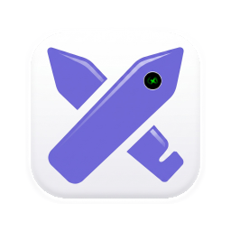

<!-- PROJECT SHIELDS -->
<div align="center">

[![Tauri v2][tauri-shield]][tauri-url]
[![React][react-shield]][react-url]
[![TypeScript][ts-shield]][ts-url]
[![Rust][rust-shield]][rust-url]
[![Vite][vite-shield]][vite-url]
[![License: MIT][license-shield]][license-url]

</div>

<!-- PROJECT LOGO -->
<br />
<div align="center">
  <a href="https://github.com/GokulAnand14/excalideck">
    
  </a>

  <h1 align="center" style="border-bottom: none; margin-top: 12px;">Excalideck</h1>

  <p align="center">
    <strong>The local-first, Obsidian-inspired sketchbook for Excalidraw.</strong>
    <br />
    Native desktop performance, nested vaults, zero cloud lock-in, and atomic file sync.
    <br />
    <br />
    <a href="#getting-started"><strong>Quick Start »</strong></a>
    &nbsp;&middot;&nbsp;
    <a href="#features">Explore Features</a>
    &nbsp;&middot;&nbsp;
    <a href="#architecture">Architecture</a>
    &nbsp;&middot;&nbsp;
    <a href="#acknowledgments">Acknowledgments</a>
  </p>
</div>

<br />

<!-- TABLE OF CONTENTS -->
<details>
  <summary><strong>Table of Contents</strong></summary>
  <ol>
    <li><a href="#about-the-project">About The Project</a></li>
    <li><a href="#downloads--platforms">Downloads & Platforms</a></li>
    <li><a href="#built-with">Built With</a></li>
    <li><a href="#features">Features</a></li>
    <li><a href="#architecture--data-model">Architecture & Data Model</a></li>
    <li>
      <a href="#getting-started">Getting Started</a>
      <ul>
        <li><a href="#prerequisites">Prerequisites</a></li>
        <li><a href="#installation--development">Installation & Development</a></li>
        <li><a href="#production-build">Production Build</a></li>
      </ul>
    </li>
    <li><a href="#vault-structure">Vault Structure</a></li>
    <li><a href="#roadmap">Roadmap</a></li>
    <li><a href="#contributing">Contributing</a></li>
    <li><a href="#license">License</a></li>
    <li><a href="#acknowledgments">Acknowledgments</a></li>
  </ol>
</details>

---

<!-- DOWNLOADS -->
## Downloads & Platforms

Pre-compiled native binaries and installers for all major desktop operating systems are available directly on [GitHub Releases][releases-url].

| Platform | Architecture | Available Formats | Download Link |
| :--- | :--- | :--- | :--- |
| ![Windows][win-badge] **Windows** | `x64` / `x86_64` | `.msi` (Windows Installer)<br>`.exe` (NSIS Setup / Portable) | [**Download Windows**][releases-url] |
| ![macOS][mac-badge] **macOS** | Apple Silicon (`arm64`)<br>Intel (`x86_64`) | `.dmg` (Disk Image)<br>`.app` (Universal Binary) | [**Download macOS**][releases-url] |
| ![Linux][linux-badge] **Linux** | `x86_64` | `.AppImage` (Universal Linux)<br>`.deb` (Debian / Ubuntu) | [**Download Linux**][releases-url] |

---

<!-- ABOUT THE PROJECT -->
## About The Project

[Excalidraw](https://github.com/excalidraw/excalidraw) is one of the best diagramming and sketching canvases ever created. However, managing hundreds of local `.excalidraw` files across different projects often leaves you juggling browser tabs, scattered files, or cloud services.

**Excalideck** brings an Obsidian-style, vault-based file management workflow directly to Excalidraw on your desktop. 

Point Excalideck at any local folder on your machine, and it instantly turns that directory into an organized visual workspace with hierarchical subfolders, instant scene switching, atomic background auto-saving, and asset isolation—all running in a lightweight native desktop container built on Rust and Tauri v2.

### Why Excalideck?

- **Local-First & Git-Friendly**: Your drawings are standard JSON `.excalidraw` files in your filesystem. Version control them with Git, back them up with Syncthing, or open them in any editor.
- **Zero-Latency Switching**: Switching between complex drawings happens in 0ms without unmounting or reinitializing the canvas.
- **Atomic Persistence**: Auto-saves happen in the background using native Rust file I/O with transactional safety to prevent canvas corruption.
- **Self-Contained Assets**: Heavy embedded image blobs are extracted and isolated into a `.assets/` directory in the background, keeping your primary sketch files clean and diff-friendly.

---

### Built With

* [![Tauri][Tauri-badge]][tauri-url] — Ultra-lightweight native Rust shell
* [![React][React-badge]][react-url] — Frontend component architecture
* [![TypeScript][TS-badge]][ts-url] — End-to-end type safety
* [![Vite][Vite-badge]][vite-url] — High-speed frontend tooling & bundling
* [![Rust][Rust-badge]][rust-url] — High-throughput file system watcher & IO engine
* [![Excalidraw][Excalidraw-badge]][excalidraw-url] — Canvas engine & drawing primitives

---

<!-- FEATURES -->
## Features

### Vault-Centric File Management
- **Local Directory Binding**: Select any folder on disk to serve as an isolated, self-contained sketching vault.
- **Nested Hierarchies**: Organize diagrams in recursive subfolders with stateful directory expansion and collapse.
- **Real-Time Vault Search**: Instant fuzzy filtering across your entire diagram collection.

### Pointer-Driven Organization
- **Native-Grade Drag & Drop**: Custom virtual pointer engine provides smooth cross-folder file moving with floating badges and drop-target highlighting.
- **Direct Move Dialog**: Right-click context menu with a fast folder selector to relocate sketches across deep directory trees in one click.

### Zero-Latency In-Memory Transitions
- **Persistent Canvas Lifecycle**: Retains the Excalidraw WebGL context in memory for instantaneous 0ms document switching without re-initialization flicker.
- **Non-Destructive Scene Hydration**: In-place scene updates preserve canvas viewport state across file loads.

### Transactional File I/O & Asset Offloading
- **Atomic Auto-Save**: Debounced disk writes with dirty-state hashing prevent redundant I/O cycles and file corruption.
- **Asset Extraction Engine**: Background Rust worker extracts embedded base64 images into an isolated `assets/` directory, keeping primary `.excalidraw` JSON files lean and diff-friendly.

### macOS-Inspired Frameless Shell
- **Custom Desktop Titlebar**: Authentic left-aligned traffic controls, active document path breadcrumbs, and integrated dark/light theme switching.
- **Minimal Resource Footprint**: Built on Tauri v2 for low memory overhead and native execution speed.

---

<!-- ARCHITECTURE -->
## Architecture & Data Model

```
┌─────────────────────────────────────────────────────────────┐
│                      Excalideck (UI)                        │
│   React 18  ·  TypeScript  ·  Vite  ·  macOS Frameless UI   │
└──────────────────────────────┬──────────────────────────────┘
                               │ Tauri IPC (Commands & Events)
┌──────────────────────────────▼──────────────────────────────┐
│                    Rust Backend (Tauri v2)                  │
│  ├─ State Manager      (Active Vault, Opened Paths)         │
│  ├─ Atomic File I/O    (Safe writing, Asset Extraction)     │
│  ├─ File Watcher       (Debounced recursive notify)         │
│  └─ Window Controls    (Frameless drag, Window state)       │
└──────────────────────────────┬──────────────────────────────┘
                               │ Direct File System Access
┌──────────────────────────────▼──────────────────────────────┐
│                     Local Vault Folder                      │
│  ├─ Architecture.excalidraw                                 │
│  ├─ UI-Flows/                                               │
│  │   └─ Login.excalidraw                                    │
│  └─ assets/                                                 │
│      └─ c8f9d0...png                                        │
└─────────────────────────────────────────────────────────────┘
```

---

<!-- GETTING STARTED -->
## Getting Started

### Prerequisites

Ensure you have the following installed on your development machine:

1. **Bun** (recommended) or **Node.js** (v18+)
   ```sh
   # Install Bun (macOS/Linux/WSL)
   curl -fsSL https://bun.sh/install | bash

   # Install Bun (Windows PowerShell)
   powershell -c "irm bun.sh/install.ps1 | iex"
   ```
2. **Rust Toolchain** (cargo, rustc 1.77+)
   ```sh
   # Install Rust
   curl --proto '=https' --tlsv1.2 -sSf https://sh.rustup.rs | sh
   ```
3. **C++ Build Tools / Platform Dependencies**:
   - **Windows**: [Visual Studio C++ Build Tools](https://visualstudio.microsoft.com/visual-cpp-build-tools/) & WebView2 Runtime.
   - **macOS**: Xcode Command Line Tools (`xcode-select --install`).
   - **Linux**: `libwebkit2gtk-4.1-dev`, `build-essential`, `curl`, `libssl-dev`, `libayatana-appindicator3-dev`, `librsvg2-dev`.

---

### Installation & Development

1. **Clone the repository**:
   ```sh
   git clone https://github.com/GokulAnand14/excalideck.git
   cd excalidraw-tauri
   ```

2. **Install frontend dependencies**:
   ```sh
   bun install
   ```

3. **Start the development application**:
   ```sh
   bun run tauri dev
   ```

---

### Production Build

To compile a production-ready, highly optimized desktop executable and installer package for your operating system:

```sh
bun run tauri build
```

The output installers (`.msi` / `.exe` on Windows, `.dmg` / `.app` on macOS, `.AppImage` / `.deb` on Linux) will be generated in `src-tauri/target/release/bundle/`.

---

<!-- VAULT STRUCTURE -->
## Vault Structure

Excalideck works with standard folders on disk. A typical vault looks like this:

```
my-sketch-vault/
├── System-Architecture.excalidraw
├── Backend-Flow.excalidraw
├── Diagrams/
│   ├── Database-Schema.excalidraw
│   └── Network-Topology.excalidraw
├── Wireframes/
│   ├── Mobile-App.excalidraw
│   └── Web-Dashboard.excalidraw
└── assets/
    └── 9a4e21fcb01e4a.png
```

- **`.excalidraw` Files**: Standard JSON files containing Excalidraw element trees, bindings, and app state.
- **`assets/` Directory**: Created automatically when images or external media are pasted into canvases.

---

<!-- ROADMAP -->
## Roadmap

- [x] **Obsidian-Style Vault Management**: Open multiple vaults and switch between recent workspaces.
- [x] **Deep Directory Tree**: Support for nested subfolders, inline creation, renaming, and deletion.
- [x] **Virtual Pointer Drag & Drop**: Smoothly re-order and move files into subfolders.
- [x] **0ms Scene Transitions**: In-memory canvas lifecycle management.
- [x] **Zero-Copy Asset Extraction**: Automatic deduplication and offloading of embedded base64 image data.
- [x] **Custom Frameless UI**: Authentic macOS-style window controls and light/dark theme synchronization.
- [ ] **Multi-Tab Support**: Tab bar for having multiple sketches open concurrently.
- [ ] **Canvas Search & OCR**: Full-text search across shapes and text elements inside vault sketches.
- [ ] **PDF & Markdown Export**: Batch export folders of sketches to multi-page PDFs or Markdown embeds.

---

<!-- CONTRIBUTING -->
## Contributing

Contributions are what make the open source community such an amazing place to learn, inspire, and create. Any contributions you make are **greatly appreciated**.

If you have an idea, improvement, or bug fix:

1. Fork the Project
2. Create your Feature Branch (`git checkout -b feature/AmazingFeature`)
3. Commit your Changes (`git commit -m 'feat: add AmazingFeature'`)
4. Push to the Branch (`git push origin feature/AmazingFeature`)
5. Open a Pull Request

---

<!-- LICENSE -->
## License

Distributed under the **MIT License**. See `LICENSE` for more information.

---

<!-- ACKNOWLEDGMENTS -->
## Acknowledgments

Excalideck is built on top of incredible open-source foundations. Huge thanks and credit to:

* [Excalidraw](https://github.com/excalidraw/excalidraw) — For creating the virtual whiteboard that revolutionized hand-drawn diagrams.
* [Tauri](https://github.com/tauri-apps/tauri) — For the memory-efficient and secure cross-platform application framework.
* [Obsidian](https://obsidian.md) — For inspiring the local-first, markdown/vault philosophy.
* [Vite](https://vitejs.dev/) & [React](https://react.dev/) — For frontend developer experience and performance.

<!-- MARKDOWN BADGES & URLS -->
[tauri-shield]: https://img.shields.io/badge/Tauri-v2.0-24C8DB?style=for-the-badge&logo=tauri&logoColor=white
[tauri-url]: https://tauri.app/
[react-shield]: https://img.shields.io/badge/React-18.3-61DAFB?style=for-the-badge&logo=react&logoColor=black
[react-url]: https://react.dev/
[ts-shield]: https://img.shields.io/badge/TypeScript-5.5-3178C6?style=for-the-badge&logo=typescript&logoColor=white
[ts-url]: https://www.typescriptlang.org/
[rust-shield]: https://img.shields.io/badge/Rust-2021-DEA584?style=for-the-badge&logo=rust&logoColor=black
[rust-url]: https://www.rust-lang.org/
[vite-shield]: https://img.shields.io/badge/Vite-6.0-646CFF?style=for-the-badge&logo=vite&logoColor=white
[vite-url]: https://vitejs.dev/
[license-shield]: https://img.shields.io/badge/License-MIT-green.svg?style=for-the-badge
[license-url]: https://opensource.org/licenses/MIT

[Tauri-badge]: https://img.shields.io/badge/Tauri-24C8DB?style=flat-square&logo=tauri&logoColor=white
[React-badge]: https://img.shields.io/badge/React-20232A?style=flat-square&logo=react&logoColor=61DAFB
[TS-badge]: https://img.shields.io/badge/TypeScript-007ACC?style=flat-square&logo=typescript&logoColor=white
[Vite-badge]: https://img.shields.io/badge/Vite-646CFF?style=flat-square&logo=vite&logoColor=white
[Rust-badge]: https://img.shields.io/badge/Rust-DEA584?style=flat-square&logo=rust&logoColor=black
[Excalidraw-badge]: https://img.shields.io/badge/Excalidraw-6965DB?style=flat-square&logo=excalidraw&logoColor=white
[excalidraw-url]: https://github.com/excalidraw/excalidraw

[win-badge]: https://img.shields.io/badge/Windows-0078D6?style=flat-square&logo=windows&logoColor=white
[mac-badge]: https://img.shields.io/badge/macOS-000000?style=flat-square&logo=apple&logoColor=white
[linux-badge]: https://img.shields.io/badge/Linux-FCC624?style=flat-square&logo=linux&logoColor=black
[releases-url]: https://github.com/GokulAnand14/excalideck/releases
